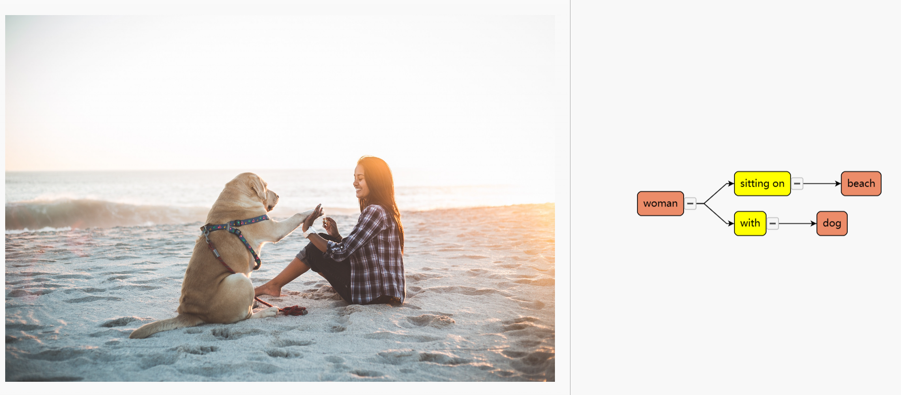
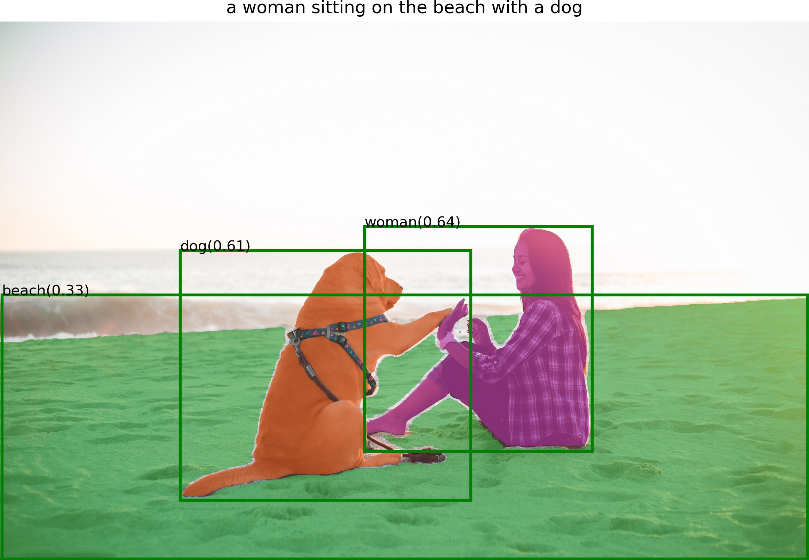

<<<<<<< HEAD
# Scene Graph Generate:


This project is still under development.Please look forward to it...

Install Segment Anything:

```bash
python -m pip install -e segment_anything
```

Install Grounding DINO:

```bash
python -m pip install -e GroundingDINO
```


Install diffusers:

```bash
pip install --upgrade diffusers[torch]
```


The following optional dependencies are necessary for mask post-processing, saving masks in COCO format, the example notebooks, and exporting the model in ONNX format. `jupyter` is also required to run the example notebooks.
```
pip install opencv-python pycocotools matplotlib onnxruntime onnx ipykernel
```

More details can be found in [install segment anything](https://github.com/facebookresearch/segment-anything#installation) and [install GroundingDINO](https://github.com/IDEA-Research/GroundingDINO#install)

- Download the checkpoint for Segment Anything and Grounding Dino:
```bash
cd Grounded-Segment-Anything

wget https://dl.fbaipublicfiles.com/segment_anything/sam_vit_h_4b8939.pth
wget https://github.com/IDEA-Research/GroundingDINO/releases/download/v0.1.0-alpha/groundingdino_swint_ogc.pth
```


## :running_man: Run Scene Graph Generate Demo

- Run Demo
```bash
export CUDA_VISIBLE_DEVICES=0
python scene_graph_gen.py \
  --config GroundingDINO/groundingdino/config/GroundingDINO_SwinT_OGC.py \
  --grounded_checkpoint groundingdino_swint_ogc.pth \
  --sam_checkpoint sam_vit_h_4b8939.pth \ 
  --input_image assets/demo.jpg \
  --output_dir "outputs" \
  --box_threshold 0.25 \
  --text_threshold 0.2 \
  --iou_threshold 0.5  \
  --device "cpu"
```
then,remove the file "./outputs/scenegraph.json" to "./SGDraw" 
- Run Visualization
```bash
cd SGDraw
python -m http.server
```
Open in browser "localhost:8000"

open "Object-Oriented_SG_Drawing.html" file

click on the button "Load JSON" and choose the file "scenegraph.json"


by the way,the object detection result at "./outputs"



## :cupid: Acknowledgements
- [Segment Anything](https://github.com/facebookresearch/segment-anything)
- [Grounding DINO](https://github.com/IDEA-Research/GroundingDINO)
- [Grounded-Segment-Anything](https://github.com/IDEA-Research/Grounded-Segment-Anything)
- [SceneGraphParser](https://github.com/vacancy/SceneGraphParser)
- [LAVIS](https://github.com/salesforce/LAVIS)
- [SGDraw](https://github.com/zty0304/SGDraw)
=======
# 홈 CCTV 이상행동 탐지 시스템

## Introduction
본 프로젝트는 홈 CCTV를 통해 이상행동을 실시간으로 탐지하는 인공지능 기반 시스템을 개발하는 것을 목표로 합니다. 이 시스템은 SceneGraph 기술을 활용하여 주거 공간에서의 비정상적인 행동 패턴을 인식하고, 즉시 사용자에게 알림을 제공함으로써 보다 빠르고 효과적인 대응을 가능하게 합니다.

## Members
- 노현호(이상행동 탐지 모델 개발)
- 강성현(영상처리)
- 박대현(백엔드 개발)
- 허인영(프론트엔드 개발)

## Functions
- **실시간 이상행동 탐지**: CCTV 카메라를 통해 입력된 비디오 스트림에서 폭행, 실신 등 비정상적인 행동을 실시간으로 감지합니다.
- **사용자 알림 시스템**: 이상행동이 감지되면, 사용자에게 알림을 발송하여 즉각적인 확인 및 대응을 유도합니다.
- **웹 및 모바일 인터페이스**: 사용자가 언제 어디서나 CCTV 영상을 확인하고 시스템의 알림을 받아볼 수 있도록 웹과 모바일 앱을 통해 접근성을 제공합니다.

## Tech Stack
- **머신러닝/딥러닝**: TensorFlow, PyTorch
- **백엔드**: Node.js, Python Flask
- **프론트엔드**: React for Web, React Native for mobile apps
- **데이터베이스**: MongoDB, MySQL
- **하드웨어**: Compatible with various IP cameras and personal devices

## How to install
```bash
# Follow local setup instructions here
>>>>>>> 316df6a7d789f0148c7c32520dc7142855a6859d
